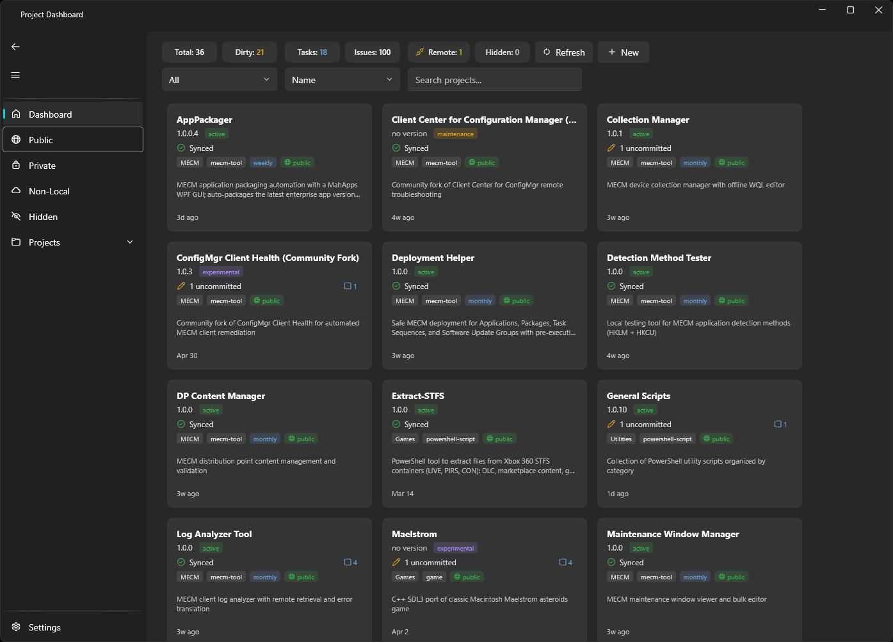

# Project Dashboard

A Fluent 2 WPF desktop application for managing and monitoring local git repositories. Scans a configurable root directory, reads git status, changelogs, readmes, and GitHub issues, and presents everything in a unified dashboard.

Built with WPF-UI (Fluent 2 design system) on .NET 10. No database, no cloud dependencies, no telemetry. Works fully offline with graceful GitHub degradation.



## Features

- **Dashboard view** -- card grid with description, version, sync status, category, project type, validation schedule, visibility, and note prefix icons (TASK/BUG/WAIT with counts)
  - Sync glyph: checkmark = committed and pushed, pencil = uncommitted changes, cloud-off = no remote
  - Visibility glyph: globe = public, lock = private, desktop = local (no remote), question = unknown
- **Project detail view** -- manifest editor, icon-prefixed notes with Edit/Done toggle, git commit history, GitHub issues, and collapsible README/CHANGELOG with markdown rendering (headers, bold, italic, code blocks, bullets, numbered lists, images, clickable links, tables)
- **Sidebar navigation** -- Dashboard / Public / Private / Non-Local / Hidden filters, plus an expandable project list with direct click-to-detail
- **New Project** -- creates folder with README, CHANGELOG, git init (metadata stored out-of-source)
- **Hidden projects** -- right-click hide/unhide, sidebar nav item
- **Context menu** -- Open Details, Refresh Status, Open on GitHub, Open Folder, Open in Terminal, Hide/Unhide
- **Sorting** -- by name, last commit, status, dirty first, category
- **Filtering** -- by category, search text, and clickable summary chips (Total, Dirty, Tasks, Issues, plus Remote-mismatch and Needs-metadata when relevant)
- **Project metadata** -- stored out-of-source in `%APPDATA%\ProjectDashboard\manifests.json`; description, project type, status, category, validation schedule, and notes (TASK/BUG/WAIT/PLAN/INFO prefixes), edited in the detail view
- **GitHub integration** -- repo visibility, open issues, clickable commit/issue links, via the `gh` CLI. The app delegates auth to `gh` and never reads, stores, or transmits tokens. When gh is missing or not signed in, a banner offers an in-app sign-in
- **Keyboard accessible** -- full no-mouse operation: arrow-key pane navigation, Tab/arrows/Enter through the card grid, keyboard-activatable chips and commit/issue rows, visible focus rings
- **Window state** -- size, position, and pane collapse state persisted across restarts
- **Discovery cache** -- instant relaunch from cached data, manual refresh bypasses cache, Sync Now button in Settings
- **Error resilience** -- global error handler shows a dialog instead of crashing; failures logged to `%APPDATA%\ProjectDashboard\log.txt`

## Requirements

| Requirement | Details |
|---|---|
| OS | Windows 10 21H2+ or Windows 11 |
| .NET | 10.0 runtime |
| Git | `git.exe` on PATH |
| GitHub CLI | `gh` on PATH (optional -- GitHub features degrade gracefully) |

## Install

Download `ProjectDashboard-Setup-*.exe` from [Releases](https://github.com/jasonulbright/project-dashboard/releases) and run it. Per-user install (no admin, no signing). Requires the [.NET 10 Desktop Runtime](https://dotnet.microsoft.com/download/dotnet/10.0) -- the installer checks for it and links the download if missing.

## Build and Run

```bash
git clone https://github.com/jasonulbright/project-dashboard.git
cd project-dashboard
dotnet build
dotnet run --project src/ProjectDashboard/ProjectDashboard.csproj
```

## Configuration

On first launch, the app scans `C:\projects` for git repositories. Change the root path in Settings.

### Project metadata

Per-project metadata that can't be derived from git is stored **outside the repos**, in a single path-keyed index at `%APPDATA%\ProjectDashboard\manifests.json` (so source trees stay source-only). Edit it in the Project Detail view. Each entry has this shape:

```json
{
  "Description": "MECM application packaging automation with WinForms GUI",
  "ProjectType": "mecm-tool",
  "Status": "active",
  "Category": "MECM",
  "ValidationSchedule": "weekly",
  "Notes": "TASK: PSADT scaffolding\nINFO: 115 packagers, schema v2"
}
```

| Field | Values |
|---|---|
| Description | Short one-liner (under 80 chars), shown on cards and detail header |
| ProjectType | mecm-tool, powershell-script, web-app, game, framework, library, dashboard, unknown |
| Status | active, maintenance, archived, experimental |
| Category | MECM, Web, Games, Infrastructure, Utilities, Uncategorized |
| ValidationSchedule | daily, weekly, monthly, none |
| Notes | Newline-separated entries with prefixes: TASK:, BUG:, WAIT:, PLAN:, INFO: |

> Legacy `project-manifest.json` files at a repo root are auto-imported into the index on first scan, then no longer needed.

## Architecture

```
src/ProjectDashboard/
    App.xaml(.cs)              # DI host, theme resources
    Models/                    # ProjectInfo, GitStatus, ProjectManifest, NoteLine, AppSettings
    Services/                  # GitService, GitHubService, ProjectDiscoveryService, MarkdownService
    ViewModels/                # MVVM ViewModels (CommunityToolkit.Mvvm)
    Views/Windows/             # FluentWindow with NavigationView
    Views/Pages/               # Dashboard, ProjectDetail, Settings
    Helpers/                   # Value converters
```

### Stack

- **WPF-UI** (lepoco/wpfui) -- Fluent 2 controls, Mica backdrop, dark/light theming
- **CommunityToolkit.Mvvm** -- source-generated ObservableObject, RelayCommand
- **Microsoft.Extensions.Hosting** -- DI container, hosted services
- **System.Text.Json** -- settings and manifest serialization (built into .NET 10)

4 NuGet packages. No database. No native dependencies.

### Template Reuse

This project is designed as a reusable Fluent UI template. To convert a future app:
1. Copy the template shell (App.xaml, MainWindow, ApplicationHostService, SettingsPage)
2. Create new Models, Services, ViewModels, Views for the app's domain
3. Update navigation items in MainWindow
4. Done -- full Fluent 2 app with zero WPF-UI boilerplate to figure out

## License

This project is provided as-is for personal and educational use.
