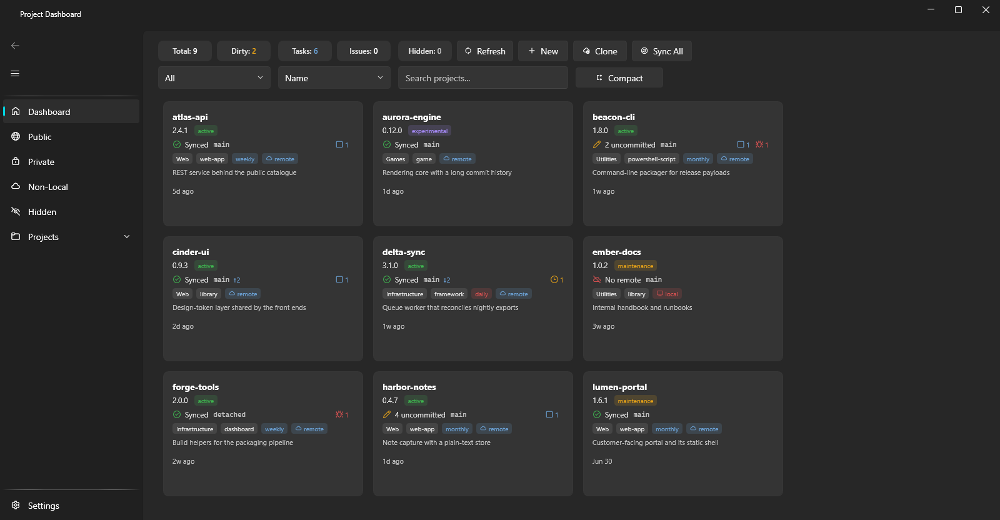
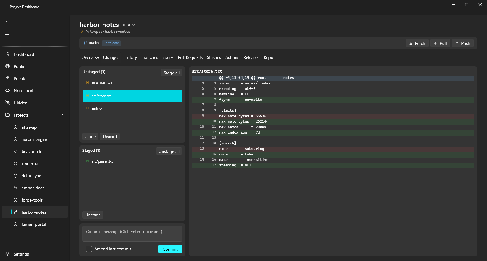
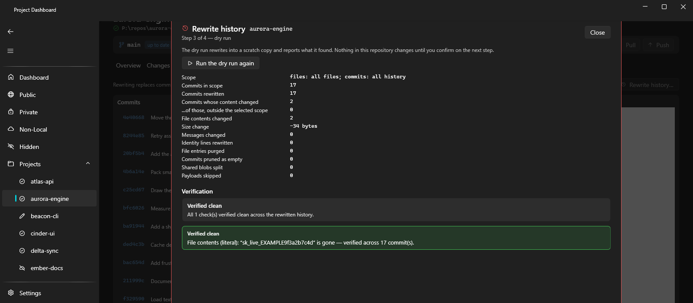
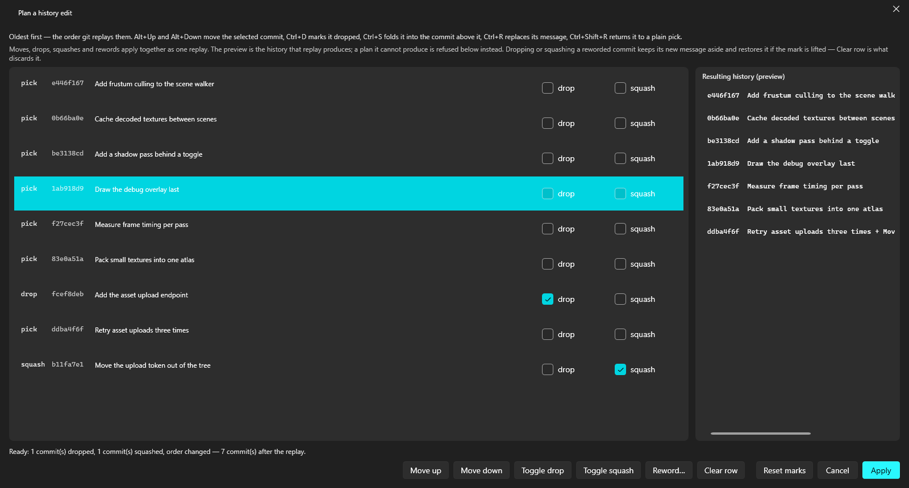

# Project Dashboard

[](https://github.com/jasonulbright/project-dashboard/actions/workflows/ci.yml)
[](https://github.com/jasonulbright/project-dashboard/releases/latest)
[](https://github.com/jasonulbright/project-dashboard/releases)
[](#requirements)
[](LICENSE)

A Fluent 2 WPF desktop application for managing local git repositories — a full desktop git client for your whole projects folder. Scans a configurable root directory, reads git status, changelogs, readmes, and GitHub issues/PRs, and gives you staging, commits, branches, history, stashes, tags, remotes, worktrees, and one-click clone across every repo in one window. History rewriting, commit surgery, and GitHub repository administration are in the app too — each one behind a backup, a preview, and a confirmation.

Built with WPF-UI (Fluent 2 design system) on .NET 10. No database, no cloud dependencies, no telemetry. Git and GitHub access are delegated to `git.exe` and the `gh` CLI as subprocesses — the app never reads, stores, or transmits tokens. Works fully offline with graceful GitHub degradation.



## Features

### Dashboard
- **Card grid** — description, version, sync status, current branch and ahead/behind, category, project type, validation schedule, visibility, and note prefix icons (TASK/BUG/WAIT with counts)
  - Sync glyph: checkmark = clean, pencil = uncommitted changes, cloud-off = no remote, warning = needs attention (conflict / mid-merge / rebase / detached), question = status unavailable
  - Visibility glyph: globe = public, lock = private, desktop = local (no remote), question = unknown
- **Sidebar navigation** — Dashboard / Public / Private / Non-Local / Hidden filters, plus an expandable project list with direct click-to-detail
- **Summary chips** (clickable filters) — Total, Dirty, Tasks, Issues, Cloud, and Hidden, plus Remote-mismatch and Needs-metadata when relevant
- **Sorting & search** — by name, last commit, status, dirty-first, category; text search
- **Pinning and density** — pin the repos you live in to the top of the grid, and switch the cards between comfortable and compact
- **Card quick actions** — Fetch / Pull / Push inline on a card, plus click-through from a card chip straight to the matching detail tab
- **Command palette** — `Ctrl+K` fuzzy-jumps to any project, runs a global action (refresh, new, clone, sync all, settings, filters), runs a verb on a named project without navigating to it (Fetch, Pull, Push, open the folder, open a terminal, copy the path, jump to Changes), and searches text and filenames across every repository
- **Clone** — pick from your GitHub repositories (type-to-filter) or paste any URL; clones into the projects root
- **Sync All** — fetches every clean repo, fast-forwards the ones behind and pushes the ones ahead; dirty, diverged, detached, and conflicted repos are skipped and reported (never a surprise merge)
- **New Project** — a template picker (empty, documentation, PowerShell script, .NET console app, .NET class library) that names exactly the files it will create, then git init + first commit (metadata stored out-of-source)
- **Export** — write the whole inventory to CSV, JSON, or a standalone HTML page
- **Auto-refresh** — a debounced file watcher updates a card within a couple of seconds of an on-disk edit, commit, or branch switch
- **Shortcut cheat sheet** — `?` lists every keyboard gesture the app registers
- **Empty states** — a missing projects folder, a folder with no repositories, and a filter that matches nothing each get their own explanation and next step

### Per-repository work area (detail view)
- **Overview** — manifest editor, icon-prefixed notes with Edit/Done toggle, collapsible README/CHANGELOG with native markdown rendering
- **Changes** — staged / unstaged / conflicted file lists, per-file native diff viewer (parsed from `git diff`, no web view) in unified or side-by-side layout with word-level intra-line highlights, stage/unstage per file or all, multi-select for batch stage/unstage/discard, per-hunk stage/unstage/discard, discard (confirmed) and untracked-delete (confirmed), a commit box with amend (prefills the last message) and live 50/72 subject/body counters, `Ctrl+Enter` to commit
- **History** — commits with paging beyond the first page, per-commit changed-file list and diff, per-file history and blame with jump-through to the commit, a click-through to the commit on GitHub, and the entry points for tags, the reflog, the commit graph, backups, deep clean, and history rewriting
- **Branches** — local branches with upstream tracking and ahead/behind, create, switch, and safe delete (refuses unmerged); rename a branch, set or clear its upstream, compare two branches, delete a branch on the remote (typed confirmation); and a remotes panel to add, rename, remove, or re-point a remote
- **Issues** — open issues as a full list (number, title, author, labels, updated); Enter or double-click opens on GitHub
- **Pull Requests** — open PRs with draft state and an aggregated checks verdict (passing / failing / pending); opens on GitHub
- **Stashes** — list, apply, pop, and drop (drop is confirmed); stash with a message and optionally include untracked files, and read a stash's diff before applying it
- **Actions** — workflow runs with status/conclusion, branch, event and elapsed time; per-run jobs and steps; re-run all or failed jobs, cancel a running run (both confirmed), and open on GitHub
- **Releases** — releases with draft/prerelease state, date and asset count; release notes rendered natively; create a release from an existing tag (title, notes, draft/prerelease); delete a release (confirmed); download an asset to a location you choose
- **Repo** — description, homepage and topics; feature toggles (issues, wiki, projects); default branch (confirmed) and visibility (confirmed by typing the full `owner/name`); this repository's unread notifications with explicit mark-read; and, only when switched on in Settings, a danger zone that can delete the repository on GitHub — typed `owner/name` confirmation, local files untouched
- **Internals** — the worktrees sharing this repository (add, remove, prune stale entries), the submodules it declares (init, update, sync, deinitialize), and a `.gitignore` editor with a path tester that says which rule decides a path
- **Branch bar** — current branch, ahead/behind, Fetch / Pull (fast-forward only) / Push (auto-sets upstream)
- **State banner** — surfaces merge / rebase / cherry-pick / revert / bisect / detached-HEAD / conflicts loudly, with an "Open in Terminal" escape hatch (the app does not build a merge tool)



### History editing
- **Rewrite wizard** — replace text in file contents, remove a path from history, rewrite commit and tag messages, or rewrite an author/committer identity; scoped to all history, glob patterns, exact paths, specific commits, or a commit range. A dry run into a scratch copy reports what would change and verifies the result before anything is applied, and a verified backup is taken before the real run. The verification report calls a scrub clean only where its coverage was total — a check that could not run is reported as a gap, not as a pass. Nothing is pushed.
- **Plan a history edit** — reorder, drop, squash, and reword commits over a range as one replay, with a live preview of the resulting history and a refusal (with the reason) for any plan git cannot produce
- **Commit surgery** — reword any commit (not only the tip), squash into the previous commit, drop a commit, inject staged changes into an older one, and reset (soft / mixed / hard), revert, or cherry-pick from the commit list
- **Backups, reflog, and force push** — browse and restore the backups taken before each history operation, inspect every position the refs have held, and push a rewritten branch only after reviewing exactly what diverged (`--force-with-lease`, at the object id the plan produced, behind a typed confirmation)
- **Deep clean** — after a scrub, expire the reflogs and prune the object store so the replaced commits stop being reachable locally. Its own typed confirmation; the backup bundle is kept
- **Recovery** — a history operation interrupted by a crash is detected on the next launch and offers the same one-click restore





### Platform
- **GitHub integration** via the `gh` CLI — repo visibility and open issue/PR counts fetched in one batched GraphQL call per ~25 repos; clickable commit/issue/PR links; in-app bug/feature filing (pre-filled, labeled new-issue page). A dashboard banner offers in-app sign-in when gh is missing or signed out
- **Remote discovery** — GitHub repos with no local clone appear as "Cloud" cards you can clone in one click (toggle in Settings)
- **Safety rails** — every destructive operation stands on an automatic backup, a preview, and a confirmation. Whole-history rewrites, force pushes, repository deletion, and remote-branch deletion require the repository name typed out. While a repo is under a long operation the file watcher, refresh timer, discovery scan, and Sync All leave it alone and catch up afterward
- **Keyboard and screen reader** — full no-mouse operation: `Ctrl+K` palette, `?` cheat sheet, arrow-key pane navigation, Tab/arrows/Enter through the card grid, `Ctrl+1`–`Ctrl+9` and `Ctrl+0` for detail tabs, Alt+Left / Backspace to go back, keyboard-activatable chips and rows, visible focus rings. Every list row, outcome, and state is named for a screen reader, and status colors hold a 4.5:1 contrast floor
- **Live-apply settings** — theme, refresh interval, watcher toggle, and projects root take effect when you save, not on the next launch
- **Window state** — size, position, and pane collapse state persisted across restarts, in device pixels so a mixed-DPI setup restores where you left it
- **Discovery cache** — instant relaunch from cached data; manual Refresh and Settings → Sync Now bypass the cache
- **Error resilience** — global handlers show a dialog or banner instead of crashing; failures logged to `%LOCALAPPDATA%\ProjectDashboard\log.txt`

## Requirements

| Requirement | Details |
|---|---|
| OS | Windows 10 21H2+ or Windows 11 |
| .NET | 10.0 Desktop Runtime |
| Git | `git.exe` on PATH (or a standard install location) |
| GitHub CLI | `gh` on PATH (optional — GitHub features degrade gracefully) |

## Install

Download `ProjectDashboard-Setup-*.exe` from [Releases](https://github.com/jasonulbright/project-dashboard/releases) and run it. Per-user install (no admin, no signing). Requires the [.NET 10 Desktop Runtime](https://dotnet.microsoft.com/download/dotnet/10.0) — the installer checks for it and links the download if missing.

### Portable

`ProjectDashboard-Portable-*.zip` needs no installation: extract it anywhere and run `ProjectDashboard.exe`. The `portable.marker` file in the extracted folder keeps all app state in a `data` folder beside the executable, so the whole thing moves with a USB stick and leaves no Project Dashboard state in your user profile. Delete the marker to use the standard per-user locations instead. If the extracted folder is not writable, the app says so at startup and stores its state in the standard per-user locations for that session. The .NET 10 Desktop Runtime is still required.

### Verifying a download

Every release carries a `checksums.txt` listing the SHA-256 of both assets, in `sha256sum` layout:

```powershell
(Get-FileHash .\ProjectDashboard-Setup-1.0.0.exe -Algorithm SHA256).Hash.ToLower()
```

Compare the result with the matching line in `checksums.txt`.

## Build and Run

```bash
git clone https://github.com/jasonulbright/project-dashboard.git
cd project-dashboard
dotnet build
dotnet run --project src/ProjectDashboard/ProjectDashboard.csproj
dotnet test
```

The test project lives in `tests/ProjectDashboard.Tests` and is excluded from the installer and the portable archive.

To build the portable archive (publishes into `installer\payload`, then zips it with the marker):

```powershell
pwsh -File installer\build-portable.ps1
```

## Configuration

On first launch, the app scans `C:\projects` for git repositories. Change the root path in Settings.

Settings also has: theme (light/dark), refresh interval, excluded directories, a `gh.exe` path picker, toggles for GitHub discovery (Cloud cards) and on-disk auto-refresh, and the opt-in that puts the danger zone on a project's Repo tab. Saving applies every one of them to the running app.

### Data storage

All app state lives outside your repositories, so source trees stay source-only:

| Path | Contents |
|---|---|
| `%LOCALAPPDATA%\ProjectDashboard\settings.json` | User preferences and window state |
| `%LOCALAPPDATA%\ProjectDashboard\discovery-cache.json` | Project scan cache (may include private repo names — never committed) |
| `%LOCALAPPDATA%\ProjectDashboard\log.txt` | Diagnostic log |
| `%APPDATA%\ProjectDashboard\manifests.json` | Per-project metadata index (roams with the user profile) |

Two things relocate all of the above under a single directory. In the portable build, the `portable.marker` file beside the executable puts them in `data\` next to it. Setting the `PD_DATA_DIR` environment variable points them anywhere you like, and takes precedence over the marker.

### Project metadata

Per-project metadata that can't be derived from git is stored in the path-keyed `manifests.json` index above and edited in the detail view. Each entry:

```json
{
  "Description": "MECM application packaging automation with WinForms GUI",
  "ProjectType": "mecm-tool",
  "Status": "active",
  "Category": "MECM",
  "ValidationSchedule": "weekly",
  "Notes": "TASK: PSADT scaffolding\nINFO: 115 packagers, schema v2"
}
```

| Field | Values |
|---|---|
| Description | Short one-liner (under 80 chars), shown on cards and detail header |
| ProjectType | mecm-tool, powershell-script, web-app, game, framework, library, dashboard, unknown |
| Status | active, maintenance, archived, experimental |
| Category | MECM, Web, Games, Infrastructure, Utilities, Uncategorized |
| ValidationSchedule | daily, weekly, monthly, none |
| Notes | Newline-separated entries with prefixes: TASK:, BUG:, WAIT:, PLAN:, INFO: |

> Legacy `project-manifest.json` files at a repo root are auto-imported into the index on first scan, then no longer needed.

## Architecture

```
src/ProjectDashboard/
    App.xaml(.cs)              # DI host, global error handlers, theme resources
    Models/                    # ProjectInfo, GitStatus, WorkingState, FileDiff, BranchInfo, GitRemote,
                               #   SideBySideDiff, CommitGraph, ReflogEntry, TagInfo, WorktreeEntry, ...
    Services/                  # ProcessRunner, GitService, GitHubService, ProjectDiscoveryService,
                               #   ProjectWatcherService, ManifestStore, MarkdownService, SettingsService,
                               #   RepoSearchService, CommitGraphService, SubmoduleService,
                               #   ProjectTemplates, PortfolioExport, AppPaths, Log
        History/               #   fast-export/import rewrite engine, path scoping, scrub verification
        Rewrite/               #   coordinator, atomic ref swap, force-push-with-lease
        Surgery/               #   rebase driver, plan compiler, commit injection
        Safety/                #   backup bundles, crash journal, recovery, repo-busy leases, deep clean
    ViewModels/                # MVVM ViewModels (CommunityToolkit.Mvvm); the detail view-model is
                               #   split into one partial per work-area surface
    Views/Windows/             # FluentWindow with NavigationView, command palette, prompt windows
    Views/Pages/               # Dashboard, ProjectDetail (tabbed work area), Settings, and the
                               #   rewrite wizard, backups, reflog, tags, graph, file-history overlays
    Helpers/                   # Value converters, diff row rendering, list focus/selection helpers
tests/ProjectDashboard.Tests/  # xUnit suite (never shipped in an installer or archive)
```

Every subprocess goes through one `ProcessRunner`: both pipes drained concurrently (no deadlocks), UTF-8 decoding (no mojibake on unicode paths/authors), `ArgumentList` quoting, timeout + cancellation, and non-zero exits surfaced rather than swallowed.

### Stack

- **WPF-UI** (lepoco/wpfui) — Fluent 2 controls, Mica backdrop, dark/light theming
- **CommunityToolkit.Mvvm** — source-generated ObservableObject, RelayCommand
- **Microsoft.Extensions.Hosting** — DI container, hosted services
- **System.Text.Json** — settings and manifest serialization (built into .NET 10)

4 NuGet packages. No database. No native dependencies. Git and GitHub go through `git.exe` and `gh` — no libgit2, no REST tokens.

## License

MIT — see [LICENSE](LICENSE).

The binaries redistributed in the installer and portable archive are listed with their
licenses in [THIRD-PARTY-NOTICES.md](THIRD-PARTY-NOTICES.md).
